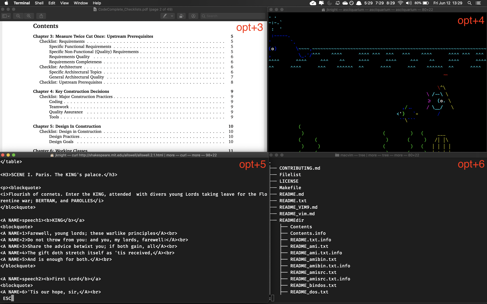
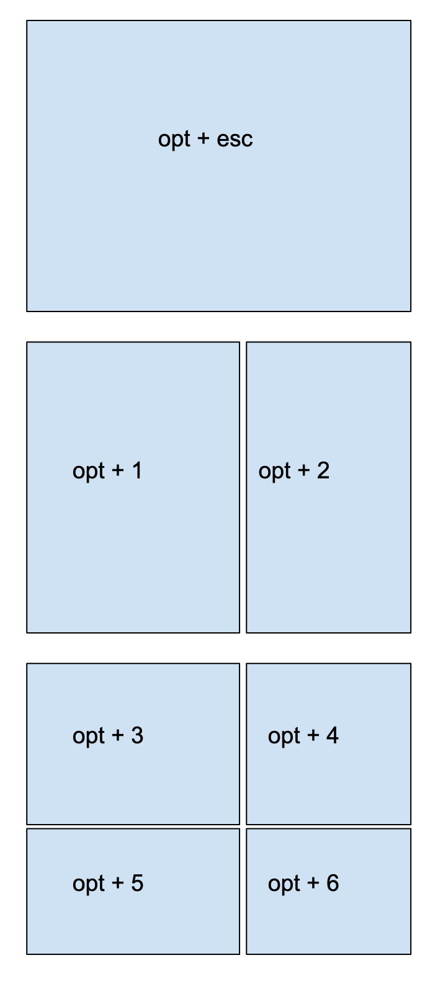
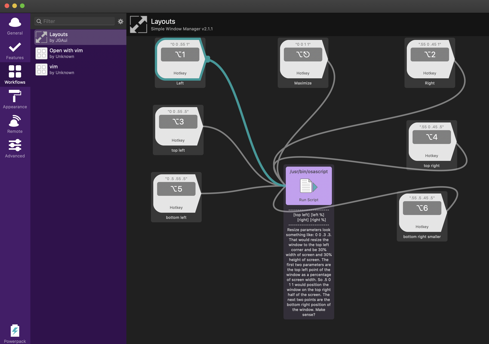

# Mac Window Layout Tiles

Keyboard friendly window layouts for MacOS.

[Layouts.alfredworkflow](Layouts.alfredworkflow) provides a simple [Aldred](https://www.alfredapp.com/) worklow for positioning and sizing windows with keyboard shortcuts.

Based on http://projects.jga.me/layouts/ by Greg Allen ([@jgaui](http://twitter.com/jgaui)) [jga.me](http://jga.me) 

There are other apps that do similar things ([Moom](https://manytricks.com/moom/) , https://setapp.com/apps/mosaic) but this is free, keyboard shortcut only, and integrates with Alfred with simple clean code.

### Install

- Download [Layouts.alfredworkflow](Layouts.alfredworkflow) 
- Open Alfred to add as a workflow.
- Right click the workflow to ensure it's enabled 
- Enjoy keyboard bliss

### Keyboard Shortcuts

### Configure

Configuration is via the Alfred workflow. There are no external files or dependencies. 

You can change the key mappings and window sizings and placements to define any keyboard shortcut for any size+position.

The x1,x2,y1,y2 convention from the original Layouts workflow is tricky to get right. Notes from the original layout convention have been added as a note in the workflow.

### TODO

- Currently works well to size windows but doesn't offer any way to navigate between windows - stil need to alt+tab (https://manytricks.com/witch/) to switch between windows. Would be nice to have tmux-like short cuts to move between windows (see https://i3wm.org/)  

